# Sliver Operator UI — Wiki & User Manual

A single-operator browser console for the [Sliver](https://github.com/BishopFox/sliver)
adversary-emulation framework. This wiki explains how the tool works, how to run it, and
what every screen does — illustrated with live captures from the lab.

> **Scope & authorized use.** Sliver is a red-team / adversary-emulation C2 framework.
> This UI — and everything in this wiki — is intended only for use against systems you own
> or are explicitly authorized to test, inside the isolated lab described below (a local
> Sliver teamserver plus a Windows VM and the Arch host). Running implants or listeners
> against machines you do not own or have permission to test is illegal in most
> jurisdictions. Keep the stack bound to `127.0.0.1`; see **Security notes**.

> **About the screenshots.** Every figure was captured live from this lab through an
> isolated headless browser (so they show real data: the lab's listeners, beacons, and
> audit trail). Images live in `images/sliver-operator-manual/`.

---

## Table of contents

1. [How it works (overview)](#1-how-it-works-overview)
2. [Architecture](#2-architecture)
3. [Prerequisites](#3-prerequisites)
4. [Installing & running](#4-installing--running)
5. [Starting & stopping the stack](#5-starting--stopping-the-stack)
6. [Authentication](#6-authentication)
7. [The operator workspace](#7-the-operator-workspace)
8. [Screen-by-screen reference](#8-screen-by-screen-reference)
9. [End-to-end lab walkthrough](#9-end-to-end-lab-walkthrough)
10. [Troubleshooting & recovery](#10-troubleshooting--recovery)
11. [Security notes](#11-security-notes)
12. [Appendix: endpoints & file layout](#12-appendix-endpoints--file-layout)

---

## 1. How it works (overview)

The Operator UI is a web front end that talks to a running Sliver **teamserver**. It does
not replace Sliver — Sliver remains the source of truth. The UI is a convenience layer
that lets you drive an engagement from a browser instead of the `sliver-client` terminal:
list and interact with sessions and beacons, manage listeners and jobs, browse remote
files, review captured loot, build implants, run Beacon Object Files (BOFs), manage
Malleable C2 profiles, and watch a live event feed and C2 topology graph.

Key properties:

- **Single operator, localhost only.** There is no multi-tenant login system. Access is
  gated by one shared token and the server binds to `127.0.0.1`.
- **Stateless.** The UI keeps no database. Everything it shows is read live from the
  teamserver over gRPC and pushed to the browser over a WebSocket.
- **Read-through to Sliver.** Anything you see here you could also do from `sliver-client`;
  the UI simply surfaces it visually and records each action to an audit log.

---

## 2. Architecture

```
Browser  (React + Vite + Tailwind)
   │   REST  /api/*      +   WebSocket  /events
   ▼
FastAPI BFF  (Python 3.11+, "backend for frontend")
   │   sliver-py  (gRPC operator client)
   ▼
Sliver teamserver  (sliver-server daemon)
   │   mTLS / HTTPS C2 listeners
   ▼
Implants  (sessions & beacons on target hosts)
```

| Layer | Process | Default bind | Role |
|---|---|---|---|
| Frontend | Vite dev server (or static `dist`) | `127.0.0.1:5173` | The React app you interact with |
| BFF | `uvicorn main:app` | `127.0.0.1:8000` | Holds the gRPC connection; exposes REST + WS |
| Teamserver | `sliver-server daemon` | `:31337` (operator gRPC), `:8443`/`:9001` (C2) | The actual C2 |

Design notes worth knowing as an operator:

- **One upstream event stream.** The BFF's `SliverHub` opens a *single* gRPC event
  subscription and fans events out to every connected browser tab via per-subscriber
  queues. Opening five tabs does not open five event streams.
- **Auto-reconnect.** If the teamserver drops, the hub retries with exponential backoff
  (1s → 30s). Connection state is broadcast as `bff:state` / `bff:connected` /
  `bff:disconnected` events, and the sidebar reflects it live.
- **Vite proxy.** In dev mode Vite proxies `/api` and `/events` to `127.0.0.1:8000`, so the
  browser never deals with CORS.

---

## 3. Prerequisites

- **Python 3.11+** (for the BFF).
- **Node 18+** (Node 22 in this lab, via `nvm`) and **pnpm** (for the frontend).
- **A running Sliver teamserver** (`sliver-server`).
- **An operator config** at `~/.sliver-client/configs/*.cfg`, generated with
  `sliver-server operator …`. The config embeds the teamserver address plus the mTLS
  material that authenticates the operator. To target a different teamserver, point the BFF
  at a different `.cfg` via `SLIVER_CFG_PATH`.

Lab paths:

| Item | Value |
|---|---|
| Project root | `~/tools/sliverui` |
| Operator config | `~/.sliver-client/configs/bellum_127.0.0.1.cfg` |
| Backend venv | `~/tools/sliverui/backend/.venv` |
| Frontend toolchain | Node 22 (`nvm`) + pnpm |
| Environment file | `~/tools/sliverui/.env` |

---

## 4. Installing & running

The `.env` in the project root supplies `SLIVER_CFG_PATH`, the UI auth token, and optional
integration paths (avgen, ngrok, BOFs).

### 4.1 Development mode (two processes)

```bash
# Backend
cd ~/tools/sliverui/backend
python -m venv .venv && source .venv/bin/activate
pip install -e .                       # or: uv pip install -e .
set -a; source ../.env; set +a         # load token + cfg path
uvicorn main:app --reload --host 127.0.0.1 --port 8000
```

```bash
# Frontend (separate terminal)
cd ~/tools/sliverui/frontend
pnpm install
pnpm dev                               # serves http://127.0.0.1:5173
```

Open **http://127.0.0.1:5173**. Vite proxies API/WS calls to the backend.

### 4.2 Production-ish single-binary mode

```bash
cd ~/tools/sliverui/frontend && pnpm build
cd ../backend && set -a; source ../.env; set +a; uvicorn main:app --host 127.0.0.1 --port 8000
# open http://127.0.0.1:8000   (backend static-serves frontend/dist)
```

### 4.3 Docker Compose

```bash
cd ~/tools/sliverui && docker compose up
```

Both services run with `network_mode: host`; `~/.sliver-client` is mounted read-only into
the backend container.

---

## 5. Starting & stopping the stack

Three independent processes. Bring them up **in order** — teamserver → backend → frontend.

### 5.1 Start everything (the exact lab commands)

```bash
# 1) Teamserver, under a memory-capped scope (prevents runaway RSS)
systemd-run --user --scope -p MemoryMax=2G -p MemorySwapMax=0 \
  bash -c 'exec sliver-server daemon > /tmp/sliver-server.log 2>&1' &
#   expect listeners on :31337 (operator), :8443 and :9001 (C2)

# 2) Backend (BFF)
cd ~/tools/sliverui/backend
set -a; source ../.env; set +a
nohup ./.venv/bin/uvicorn main:app --host 127.0.0.1 --port 8000 > /tmp/bff.log 2>&1 &

# 3) Frontend (Vite)
cd ~/tools/sliverui/frontend
export NVM_DIR="$HOME/.nvm"; . "$NVM_DIR/nvm.sh"; nvm use 22
nohup ./node_modules/.bin/vite --host 127.0.0.1 --port 5173 --strictPort > /tmp/vite.log 2>&1 &
```

### 5.2 Health checks

```bash
ss -tlnp | grep -E ':31337|:8443|:9001|:8000|:5173'
curl -s http://127.0.0.1:8000/api/health | python3 -m json.tool
```

A healthy `/api/health` reports `"connected": true`, the teamserver version, and the
`cfg_path` in use.

### 5.3 Stop everything

```bash
pkill -f "vite --host 127.0.0.1 --port 5173"
pkill -f "uvicorn main:app"
pkill -f "sliver-server daemon"
```

Stopping the teamserver does **not** delete session/beacon history — Sliver persists its
own state, and the BFF reconnects automatically when it returns.

---

## 6. Authentication

The whole app sits behind a single token gate. Until you supply a valid token you see a
centered **"UI auth token required"** card instead of the workspace.

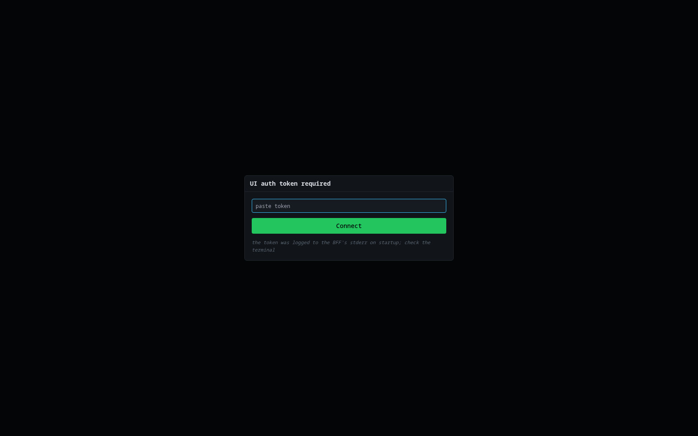

The token is read by the backend from `SLIVER_UI_TOKEN` (in `.env`) and logged to the BFF's
stderr on startup:

```
WARNING sliverui.auth: UI auth token loaded from SLIVER_UI_TOKEN
```

Paste it and click **Connect**. The token is stored in the tab's `sessionStorage`
(key `ui_token`) and sent as a `Bearer` header on every `/api/*` call, and as a `?token=`
query param on the `/events` WebSocket and on ``/download GETs that can't send headers.

**Re-prompting.** If a request returns `401`, or the WebSocket closes with code `1008`, the
app fires a `need-auth` event and drops you back to this prompt mid-session — your
navigation state is preserved; you just re-enter the token.

### 6.1 How the tokens are generated

There are two distinct secrets in this stack — don't confuse them.

**The UI auth token (`SLIVER_UI_TOKEN`)** — the one you paste into the browser. It's
resolved by the backend's `load_or_generate_token()` (in `ui/backend/auth.py`):

- **If `SLIVER_UI_TOKEN` is set in the environment**, it's used verbatim. `scripts/setup.sh`
  generates that value once from the kernel CSPRNG and writes it into `.env`:

  ```bash
  TOKEN="$(head -c 32 /dev/urandom | base64 | tr -dc 'A-Za-z0-9' | head -c 40)"
  ```

  i.e. 32 random bytes from `/dev/urandom`, base64-encoded, reduced to 40 alphanumerics.
- **If it's not set**, the backend mints one at startup with Python's
  `secrets.token_urlsafe(32)` (32 cryptographically-secure random bytes, ~256 bits) and
  logs it once to stderr (`/tmp/bff.log`) so you can copy it.

It's validated with `secrets.compare_digest()` — a constant-time comparison that avoids
timing side-channels — and accepted either as an `Authorization: Bearer` header or a
`?token=` query param. `/api/health` is the only unauthenticated route. The token lives only
in the process/env server-side and in the tab's `sessionStorage` client-side; it's never
written to a database.

**The Sliver operator token (the `.cfg`)** — a *different* credential, used by the BFF to
authenticate to the teamserver, not by you in the browser. It's created when `setup.sh` runs:

```bash
sliver-server operator --name "$USER" --lhost 127.0.0.1 --save ~/.sliver-client/configs/
```

That emits an operator config (`.cfg`, JSON) containing **mutual-TLS material** — a
per-operator client certificate and private key signed by the teamserver's operator CA, plus
the CA cert and server address. Authentication to the teamserver's gRPC port (`:31337`) is by
that client certificate, not a bearer string. The BFF (via `sliver-py`) loads the `.cfg`
pointed at by `SLIVER_CFG_PATH`. Because it holds private-key material the `.cfg` is
git-ignored and must never be committed.

> Rule of thumb: pasting it into the browser's "UI auth token required" box → it's the UI
> token. A tool or `sliver-client` loading a `.cfg` to reach the teamserver → it's the
> operator credential.

---

## 7. The operator workspace

Once authenticated you get the persistent layout: a left **sidebar** for navigation, the
main content pane, and the **Events** drawer on the right. The bottom of the sidebar shows a
green **ONLINE** badge, the teamserver version, and the connected **operators** count.

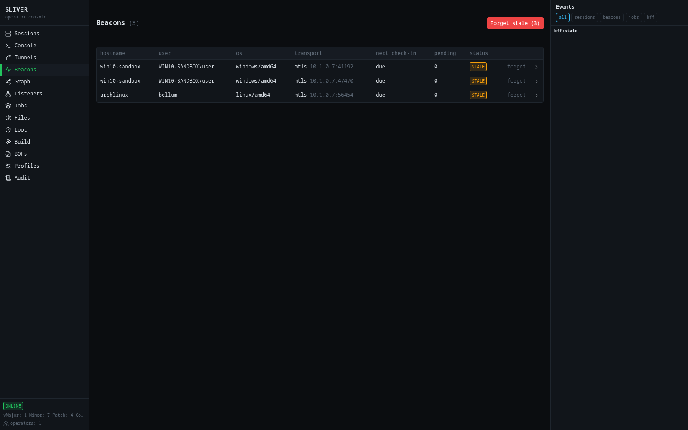

### 7.1 Sidebar navigation

| Order | Tab | Purpose |
|---|---|---|
| 1 | **Sessions** | Interactive (real-time) implant connections |
| 2 | **Console** | Per-implant command console (xterm) |
| 3 | **Tunnels** | Port forwards & SOCKS proxies through a session |
| 4 | **Beacons** | Asynchronous (check-in) implants |
| 5 | **Graph** | Live C2 topology graph |
| 6 | **Listeners** | C2 listeners (start/stop, ngrok exposure) |
| 7 | **Jobs** | Running teamserver jobs |
| 8 | **Files** | Remote filesystem browser for the selected implant |
| 9 | **Loot** | Captured artifacts (creds, files, screenshots) |
| 10 | **Build** | Implant builder + avgen/msfvenom payloads |
| 11 | **BOFs** | Beacon Object File library |
| 12 | **Profiles** | Malleable C2 profile presets |
| 13 | **Audit** | Operator action audit log |

### 7.2 Events drawer

The right-hand **Events** panel (visible in the screenshot above) is a live feed of
teamserver events with filter chips: **all · sessions · beacons · jobs · bff**. It shows new
session/beacon registrations, job changes, task completions, and BFF connection-state
messages (`bff:state`). Keep it open during an engagement to watch implants check in and
tasks finish in real time. The connection state shown here is what the sidebar's ONLINE
badge tracks (1s→30s reconnect backoff if the teamserver drops).

---

## 8. Screen-by-screen reference

Empty states are handled explicitly throughout (e.g. "No sessions", "No beacons",
"no active sessions", "No BOFs found"), so a blank screen before implants land is normal.

### 8.1 Sessions

Interactive implants: a live connection where commands run and return immediately. Columns:
`hostname`, `username`, `os`, `transport`, `last checkin`, `state`. When empty it shows
**"No sessions / No interactive sessions yet"** with a **build an implant** shortcut.

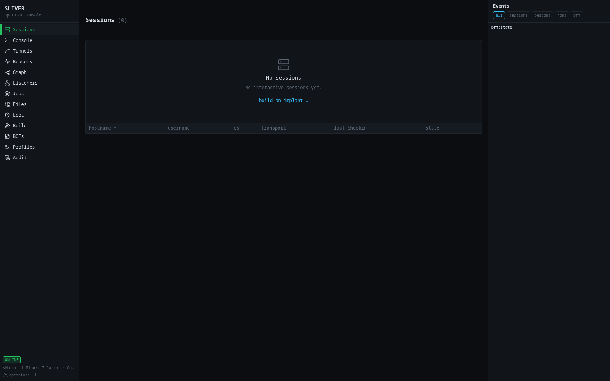

From a session you open its **Console**, browse its **Files**, or open **Tunnels**.

### 8.2 Console

A per-implant terminal built on **xterm.js**. Use **+ open** to attach a tab to a target
from the picker; commands stream back into the terminal. Empty state:
**"No tabs attached — Attach a remote target from the picker to start driving it."**

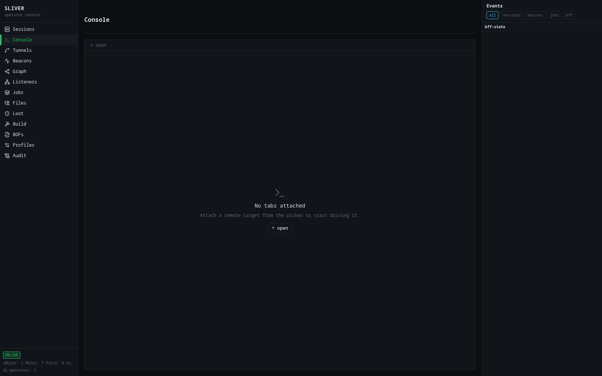

Commonly used commands include `info`, `whoami`/`getuid`, `pwd`/`cd`/`ls`, `cat`, `ps`,
`download`/`upload`, `screenshot`, `exec`/`execute`, `shell`, `kill`, and the tunnel
commands `portfwd`/`rportfwd`/`socks5`.

### 8.3 Tunnels

Pivoting through a **session** (session-only). As the screen notes, each tunnel runs as a
long-lived `sliver-client` subprocess on the host, and restarting the BFF tears them all
down. With no live session it reads: **"no active sessions; tunneling requires a session.
promote a beacon from the Graph or Console (interactive) to enable."**

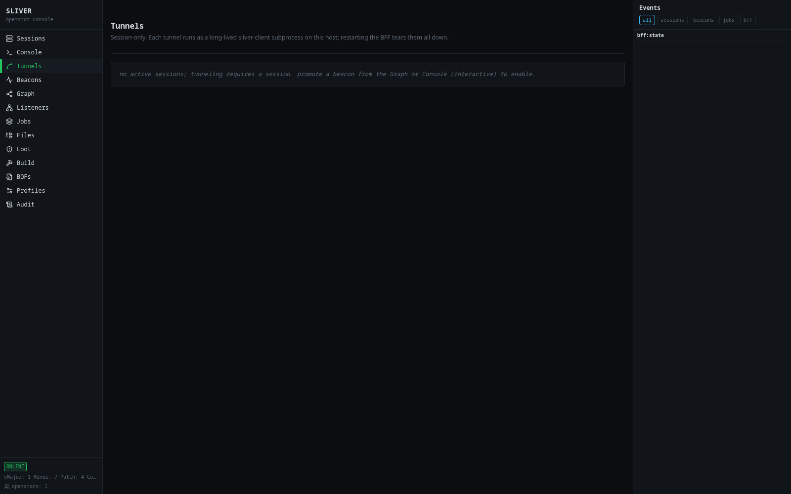

Three tunnel kinds are supported once a session exists:

| Kind | Meaning |
|---|---|
| `portfwd` | Local port forward — a local port maps to a remote address reachable from the implant |
| `rportfwd` | Remote port forward — a port on the target forwards back to the operator side |
| `socks5` | A local SOCKS5 proxy that routes through the implant — point other tooling at it |

### 8.4 Beacons

Asynchronous implants: they check in on an interval (with jitter), pull queued tasks, run
them, and return results on the next check-in. Columns: `hostname`, `user`, `os`,
`transport`, `next check-in`, `pending` (queued tasks), `status` (a **STALE** badge marks
beacons that have missed expected check-ins). Each row has a **forget** action, and the
header offers a bulk **Forget stale (N)**.


Work you queue runs on the next check-in, so beacon actions are delayed by
`interval ± jitter`.

### 8.5 Graph

A live **C2 topology** graph: the teamserver at the top, its listeners beneath, and each
implant linked to the listener it called in on. Solid vs **dashed red** edges distinguish
healthy from stale implants. A **Filters** panel toggles node types — *teamservers,
listeners, beacons, sessions, hosts* — plus a *grid* overlay; top-right buttons **zoom to
fit** and show info. The footer summarizes counts, e.g. *"3 implants · 2 listeners · last
update … · 3 stale beacons"*.

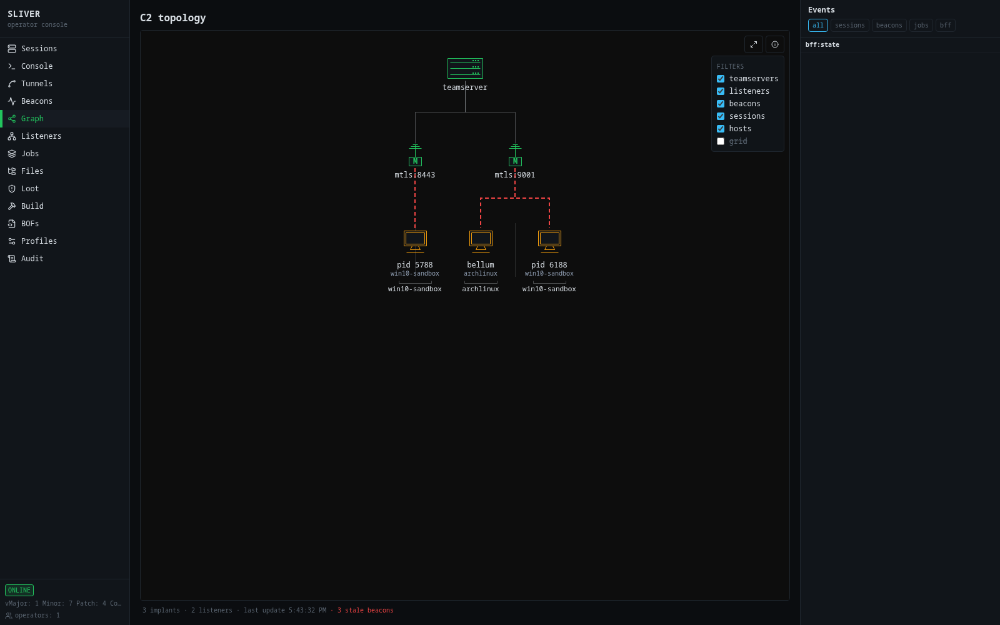

### 8.6 Listeners

Manage the teamserver's C2 listeners. **Start listener** takes a `kind` (e.g. http/https/
mtls/dns), `host`, `port`, and an optional `website`. **Active listeners** lists each one's
`id`, `name`, `protocol`, `port`, `domains`, and **public exposure** (an **Expose via
ngrok** button), with a **stop** action. In this lab two mTLS listeners run on `:8443` and
`:9001`.

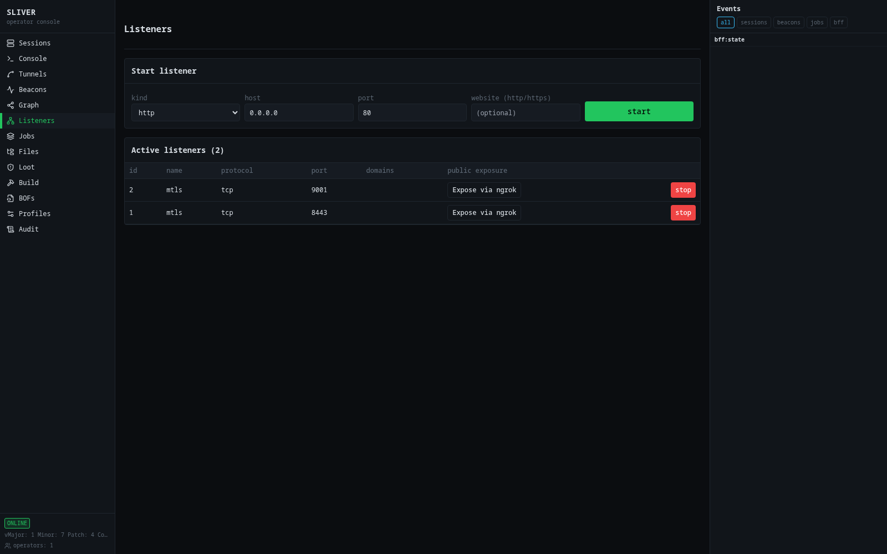

> **Public-exposure warning.** While an ngrok tunnel is open the listener is
> internet-reachable. The mTLS certificate chain still gates real implants, but anyone who
> reaches the address can attempt a handshake — **stop the tunnel when done**, and note that
> implants built against the public address can't call back once it's closed. ngrok controls
> return `503` until `NGROK_AUTHTOKEN` is set in `.env`. Only expose authorized
> infrastructure.

### 8.7 Jobs

Lists running teamserver **jobs** (a listener is itself a job, plus any other long-running
server task). Stopping a job here stops the underlying listener/task.

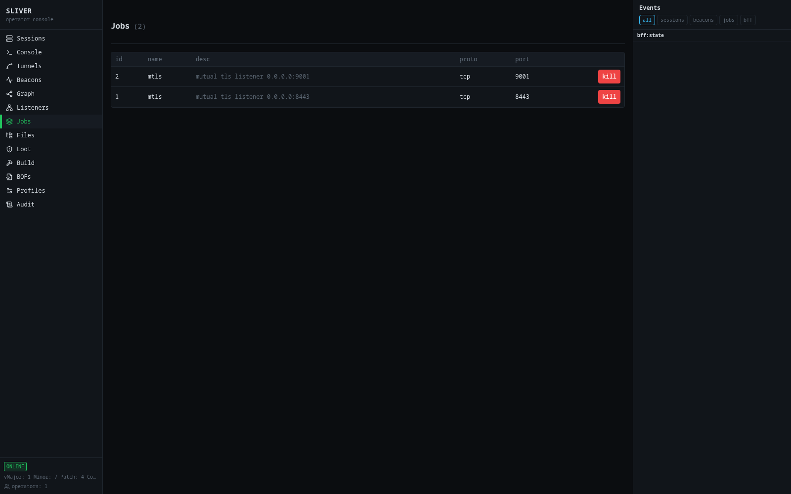

### 8.8 Files

A remote filesystem browser for the currently selected implant: a `path` bar and an
**up one level** control navigate directories; downloads land in **Loot** and you can upload
to the target. With no implant selected it shows **"No target selected"**.

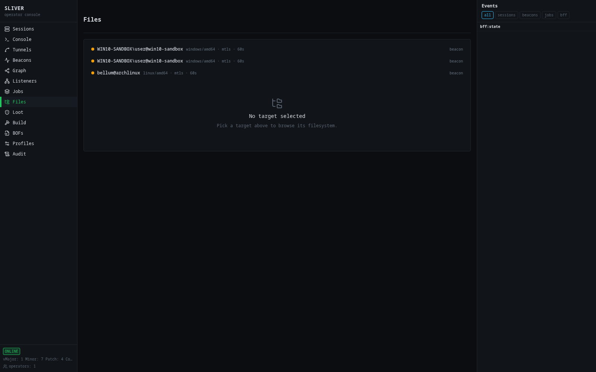

### 8.9 Loot

Sliver's loot store — downloaded files, screenshots, and credentials captured during the
engagement. Before anything is captured it shows **"no loot captured yet"**. This is where
`screenshot` and `download` output lands.

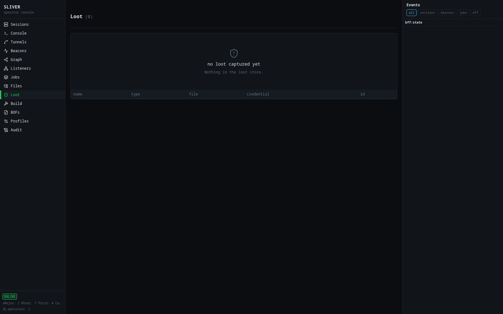

### 8.10 Build

The implant builder. Two payload families:

1. **Sliver implant (native mTLS/HTTPS)** — a first-class Sliver implant. Fields: `goos`,
   `goarch`, `format` (e.g. `exe`), optional `name`, **C2 URL** (e.g. `mtls://10.1.0.7:8443`),
   a **beacon (vs. always-on session)** toggle with a **beacon interval (seconds)**, and
   **obfuscate symbols**. Builds typically take 30–90 s (300 s cap).
2. **avgen / msfvenom** — generates Metasploit-compatible payloads. A **Target** card takes
   `--lhost`, `--lport`, `--target`, and `--arch`; **Payload source** picks exactly one of
   msfvenom (default), raw shellcode, an arbitrary PE via donut, or a mimikatz preset. The
   panel reads `avgen.py` from `AVGEN_PATH`; if it isn't found it shows the expected path.

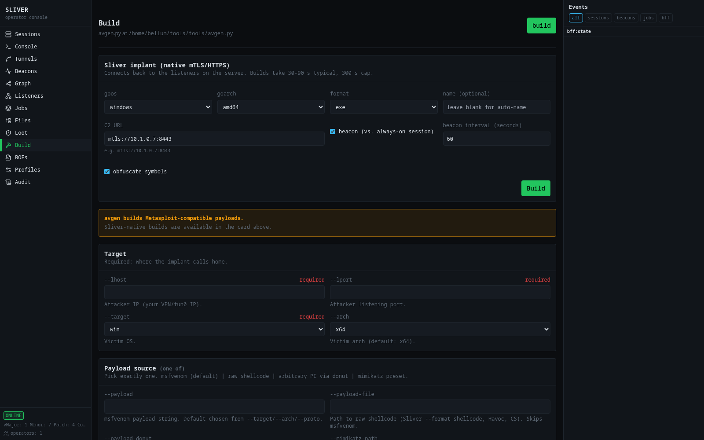

Build only payloads intended for your authorized lab targets.

### 8.11 BOFs

The **BOF Library** lists Beacon Object Files (compiled `.o` COFF objects executed in-memory
by an implant). It scans `$BOF_DIR` (default `~/.sliver/bofs`), offers a **target session**
selector, and for each BOF builds the equivalent `inline-execute` console command. With no
objects on disk it shows **"No BOFs found"** plus the directory it scanned and instructions
to populate it (drop `.o` files into category subdirs, or point `$BOF_DIR` elsewhere and
restart the BFF).

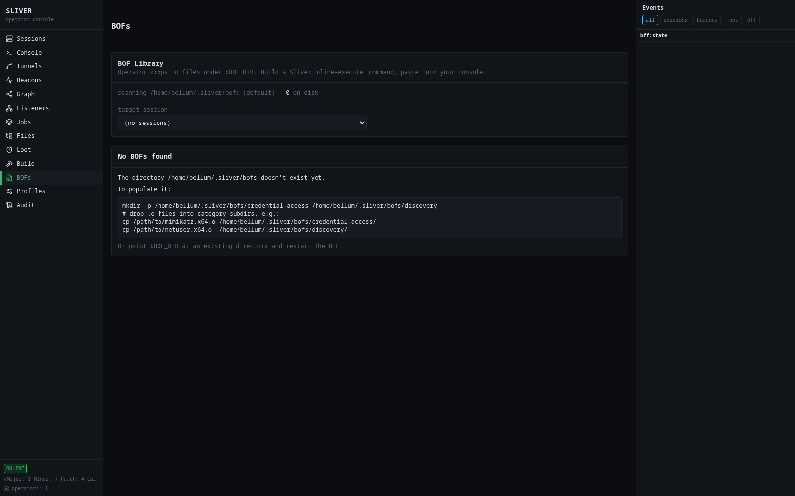

### 8.12 Profiles

**Malleable C2 Profile Presets** — reusable `http-c2.json` configs that shape implant
traffic. Built-in presets include **amazon-cloudfront**, **windows-update**, and
**generic-cdn**; each shows a description, a **copy**/**download** action, and a JSON preview
(user-agent, URL parameters, headers, file extensions, poll paths…). As the screen notes,
save a preset into `~/.sliver/configs/` on the server, restart `sliver-server`, then
reference it per-listener.

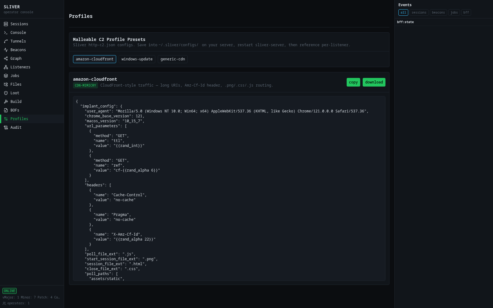

### 8.13 Audit

The **Audit log** records operator actions. The header notes it's read from
`$AUDIT_LOG_PATH`, refreshes every 10 s, and hides polling actions by default. Filter boxes
narrow by **operator (contains)** and **action (contains)**; a **show polling** toggle and a
**pause** button control the live view. Columns: `time`, `operator`, `action` — actions are
the underlying gRPC calls (e.g. `/rpcpb.SliverRPC/Execute`, `…/Screenshot`, `…/Ls`,
`…/OpenSession`, `…/Generate`, `…/GetBeaconTaskContent`, `…/RmBeacon`).

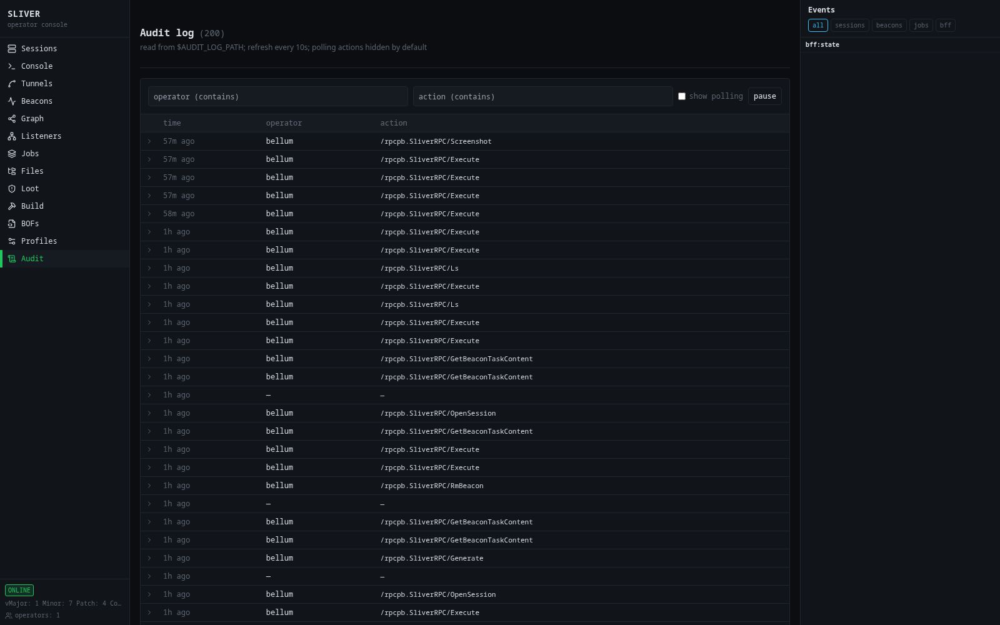

---

## 9. End-to-end lab walkthrough

Reference workflow against the lab Windows VM (`win10-sandbox`, `10.1.0.7`) and the Arch
host. Run it only in this isolated lab.

1. **Confirm a listener.** Open **Listeners**; verify the mTLS listener on `:8443` is up
   (start one if needed).
2. **Build an implant.** **Build → Sliver implant (native mTLS/HTTPS)**: set **C2 URL** to
   `mtls://10.1.0.7:8443`, choose `goos = windows`, `goarch = amd64`, a `format`, decide
   **beacon vs. session**, then **Build**.
3. **Stage to the target.** Move the artifact to the Windows VM through your normal lab
   channel and run it. Run a Linux build on the Arch host to demonstrate a second implant.
4. **Catch the callback.** Watch the **Events** drawer for the registration event. An
   interactive implant appears under **Sessions**; a beacon appears under **Beacons** with a
   `next check-in` value.
5. **Interact.** Open the **Console** for a session and run `info`, `whoami`, `ps`, `ls`.
   Take a **screenshot** and **download** a file — both land in **Loot**.
6. **Browse files.** Use **Files** to navigate the target filesystem and pull a file.
7. **Pivot.** In **Tunnels** (session-only) stand up a **SOCKS5** proxy or a port forward;
   promote a beacon to a session first from the **Graph** or **Console** if needed.
8. **Visualize.** Open **Graph** to see the teamserver, listeners, and implants, with stale
   edges dashed red.
9. **Review & clean up.** Check **Audit** to confirm the actions were logged, then kill the
   session, **Forget** stale beacons, and stop any ngrok exposure.

---

## 10. Troubleshooting & recovery

### 10.1 Nothing loads / blank page

Check the three layers bottom-up:

```bash
ss -tlnp | grep -E ':31337|:8443|:9001|:8000|:5173'
curl -s http://127.0.0.1:8000/api/health | python3 -m json.tool
tail -n 20 /tmp/sliver-server.log /tmp/bff.log /tmp/vite.log
```

Missing teamserver ports → teamserver down; missing `:8000` → BFF down; missing `:5173` →
frontend down. Restart in order (Section 5.1).

### 10.2 Recovering after a host crash / OOM

The teamserver runs under a 2 GB cap; a host crash kills all three processes. Restart in
order (teamserver → backend → frontend). Gotchas seen during recovery:

- **`npm: command not found`** — Node comes from `nvm`. Load it first:
  `export NVM_DIR="$HOME/.nvm"; . "$NVM_DIR/nvm.sh"; nvm use 22`.
- **pnpm "approve-builds" / install fails** — native deps (esbuild) need their build scripts
  allowed once: `pnpm install --config.dangerouslyAllowAllBuilds=true`, then launch Vite
  directly with `./node_modules/.bin/vite --host 127.0.0.1 --port 5173` to skip pnpm's
  pre-run install check.
- **First load is slow / times out** — Vite re-optimizes dependencies on the first request
  after a restart; wait for `ready in …` in `/tmp/vite.log`, then reload.

### 10.3 "UI auth token required" keeps reappearing

A `401`/`1008` re-triggers the gate. Confirm the pasted token matches `SLIVER_UI_TOKEN` in
`.env` (the backend logs it on startup) and that the backend was started with the env loaded
(`set -a; source ../.env; set +a`).

### 10.4 Sidebar / ONLINE badge shows disconnected

The BFF lost the teamserver and is retrying (1s→30s). If it never reconnects, check
`/tmp/sliver-server.log`, confirm `:31337` is listening, and verify `SLIVER_CFG_PATH` points
at a valid operator `.cfg`.

### 10.5 ngrok controls return 503

`NGROK_AUTHTOKEN` is not set in `.env`. Public exposure is disabled until a token is provided.

---

## 11. Security notes

- **Bind to localhost.** The UI has no real authentication beyond one shared token. Keep the
  BFF and frontend on `127.0.0.1`. For remote access use SSH port forwarding or WireGuard —
  don't add a public login page.
- **Treat the token as a secret.** It's logged to the BFF stderr and lives in `.env`. Anyone
  with it (and reach to `:8000`) controls your C2.
- **ngrok exposure is high-risk.** An open tunnel makes a listener internet-reachable. Only
  expose authorized infrastructure, and close the tunnel as soon as you're done.
- **Operate only in scope.** Build, deliver, and run implants only against systems you own or
  are authorized to test. In this lab that means the Windows VM and the Arch host — nothing
  else.
- **Clean up.** Kill sessions, forget stale beacons, stop listeners/exposures, and clear loot
  you no longer need at the end of an engagement.

---

## 12. Appendix: endpoints & file layout

### 12.1 REST / WebSocket surface (selected)

| Method & path | Used by |
|---|---|
| `GET /api/health` | Stack/connection health |
| `GET /api/sessions` · `GET /api/beacons` | Sessions / Beacons tables |
| `GET /api/jobs` | Jobs / listeners |
| `GET /api/graph` | C2 topology graph |
| `GET/POST /api/ngrok` · `DELETE /api/ngrok/{id}` | Public exposure |
| `GET /api/implants/{id}/info` | Implant metadata |
| `POST /api/implants/{id}/ls · /ps · /exec · /screenshot · /download · /kill` | Implant actions |
| `GET /api/implants/{id}/tunnels` · `POST …/portfwd · …/rportfwd · …/socks5` | Tunnels |
| `GET /api/build/sliver/options` · `POST /api/build/sliver` | Implant builder |
| `GET /api/tasks/{id}` · `…/result` | Async task polling (beacon tasks) |
| `WS /events` | Live event stream (sessions, beacons, jobs, BFF state) |

All `/api/*` calls and the `/events` socket require the `Bearer` token.

### 12.2 Project layout

```
sliverui/
├── .env                    # SLIVER_CFG_PATH, SLIVER_UI_TOKEN, AVGEN_*, BOF_*, NGROK_*
├── docker-compose.yml
├── backend/
│   ├── main.py             # FastAPI app + static-serve dist
│   ├── config.py           # SLIVER_CFG_PATH resolution
│   ├── sliver_client.py    # SliverHub: singleton gRPC client + event fanout
│   ├── ws.py               # /events WebSocket
│   └── routes/             # sessions, beacons, listeners, jobs, files, loot, graph,
│                           # tunnels, build, build_sliver, bofs, profiles, audit, ngrok,
│                           # implants, operators, tasks
└── frontend/
    └── src/
        ├── api.ts, ws.ts, types.ts, lib/auth.ts
        ├── components/     # Layout, AuthGate, EventDrawer, OperatorsIndicator, chrome/*, ui/*
        └── views/          # Sessions, Console, Tunnels, Beacons, Graph, Listeners, Jobs,
                            # Files, Loot, Build, Bofs, Profiles, Audit
```

### 12.3 Quick reference — start the stack

```bash
# teamserver
systemd-run --user --scope -p MemoryMax=2G -p MemorySwapMax=0 \
  bash -c 'exec sliver-server daemon > /tmp/sliver-server.log 2>&1' &
# backend
cd ~/tools/sliverui/backend && set -a; source ../.env; set +a
nohup ./.venv/bin/uvicorn main:app --host 127.0.0.1 --port 8000 > /tmp/bff.log 2>&1 &
# frontend
cd ~/tools/sliverui/frontend
export NVM_DIR="$HOME/.nvm"; . "$NVM_DIR/nvm.sh"; nvm use 22
nohup ./node_modules/.bin/vite --host 127.0.0.1 --port 5173 --strictPort > /tmp/vite.log 2>&1 &
# then open http://127.0.0.1:5173
```
